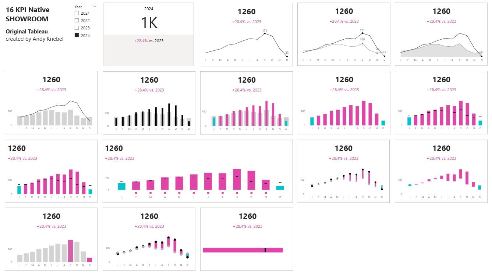
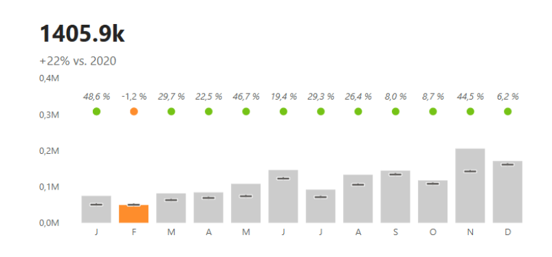

# KPI Cards in Power BI (Native Visuals)

In this tutorial, we challenge the idea that Tableau is superior to Power BI for design.

By recreating Andy Kriebel’s well-known KPI cards using only native Power BI visuals, this project shows how far you can go with the right techniques.

---

## 🎥 Watch the tutorial for this Card

[Recreating KPI Cards in Power BI](https://youtu.be/wHsDSPia0Nk)

---

## Get the full file with all 16 KPI Cards

[16 KPI Cards in Power BI](./16-KPI-Cards-Native-Visuals.pbix)

---

## 🧠 What this project does

This project demonstrates how to build a visually strong KPI cards in Power BI without using custom visuals.

It shows how to:
- design clean and structured KPI layouts  
- highlight key metrics effectively  
- create visually appealing dashboards using native components  
- bring design thinking into Power BI  

---

## 🚀 What you’ll learn

In this tutorial, you’ll see:

- how to recreate advanced KPI cards using native visuals  
- how to structure layouts for better readability  
- how to combine visuals to simulate more advanced designs  
- how to make dashboards more intuitive and user-friendly  

---

## 📂 Resources

Use the files provided in this folder to explore and reuse the KPI card designs:

- Power BI file(s) with KPI card examples  
- Supporting assets used in the visuals  

---

## 🎯 Who this is for

- Power BI developers who care about design  
- BI analysts building dashboards for stakeholders  
- Anyone comparing Power BI and Tableau  
- Teams looking to improve dashboard usability  

---

## 💡 Use cases

- Highlighting key business metrics  
- Executive dashboards  
- Sales and performance tracking  
- Website or operational monitoring  

---

## 🛠️ How to use

1. Open the Power BI file  
2. Explore how the visuals are structured  
3. Reuse and adapt the KPI cards for your own data  
4. Adjust layout, colors, and measures to fit your use case  

---

## 🔄 Extend this

You can build on this approach by:
- creating reusable KPI templates  
- standardizing dashboard design across teams  
- combining with DAX-driven insights  
- integrating into larger reporting solutions  
