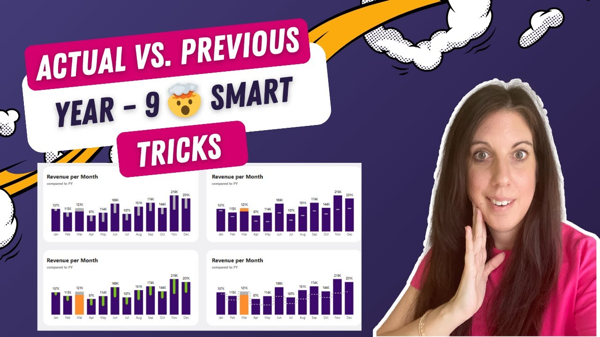
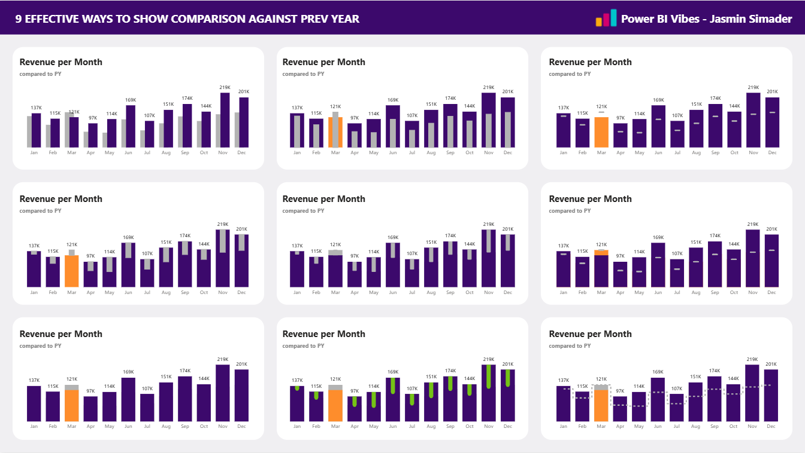

# 9 Powerful Ways to Compare Actual vs Previous Year in Power BI

In this tutorial, you’ll learn 9 different ways to compare Actual vs Previous Year values in Power BI using column charts and error bars.

These techniques help you visualize year-over-year performance in a clear, structured, and professional way.

---

## 🎥 Watch the tutorial

[Compare Actual vs Previous Year in Power BI](https://www.youtube.com/watch?v=rqfPk3FWVhw)

---

## 🧠 What this project does

This project shows multiple visual approaches to compare current vs previous year values.

It helps you:
- analyze year-over-year performance  
- highlight differences and trends  
- choose the right visual for your use case  
- improve clarity and readability in reports  
- create more impactful KPI comparisons  

---

## 🚀 What you’ll learn

In this tutorial, you’ll see:

- 9 different ways to compare Actual vs Previous Year  
- how to use column charts effectively  
- how to use error bars for comparisons and deltas  
- when to use which visualization pattern  
- best practices for clear and professional reporting  

---

## 📂 Resources

### Power BI Starter File

Explore all comparison techniques:

➡️ [Open Power BI file](./Power%20BI%20Vibes_Comparison%20AY%20to%20PY%20Column%20Charts_Starter.pbix)

---

## 🖼️ Preview

---

## 🎯 Who this is for

- Power BI developers building KPI reports  
- BI analysts working with time-based comparisons  
- Anyone analyzing trends and performance  
- Teams creating management dashboards  

---

## 💡 Use cases

- Sales vs previous year  
- Revenue comparisons  
- KPI tracking over time  
- Performance analysis dashboards  
- Executive reporting  

---

## 🛠️ How to use

1. Watch the tutorial  
2. Open the Power BI file  
3. Explore the different comparison techniques  
4. Choose the pattern that fits your use case  
5. Apply it to your own dataset  

---

## 🔄 Extend this

You can build on these techniques by:
- combining with KPI cards  
- integrating into dashboards  
- adding dynamic formatting  
- using calculation groups for automation  

---

## 🔗 Related content

🎥 YouTube: [Power BI with AI Vibes](https://www.youtube.com/@BIVibes-JasminSimader)  
🏠 Website: [Jasmin Simader](https://www.jasminsimader.com/)  
👩🏻‍💻 LinkedIn: [Jasmin Simader](https://www.linkedin.com/in/jasmin-simader)  
📝 Blog / Medium: [Medium Blog](https://medium.com/@jasminsimader)
