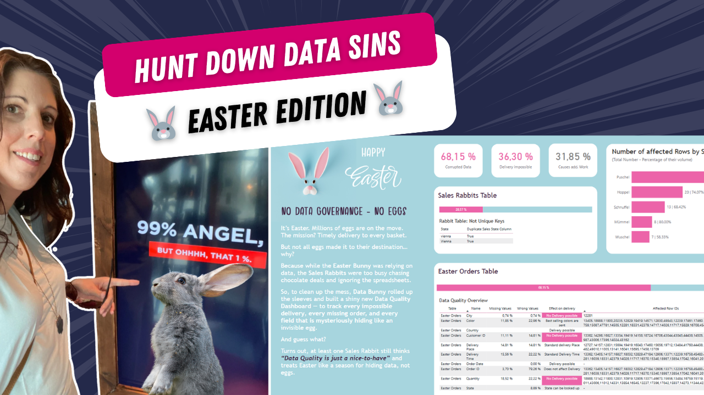

# Data Health Dashboard in Power BI (Easter Edition)

In this tutorial, you’ll learn how to build a Data Quality Dashboard in Power BI by tracking common data issues in a fun Easter-themed scenario.

Using real-world data quality challenges, we create a structured and visual approach to identify, monitor, and improve data health.

---

## 🎥 Watch the tutorial

[Track Data Quality Like a Pro in Power BI](https://youtube.com/watch?v=x-enT6JSUZ4&feature=youtu.be)

---

## 🧠 What this project does

This project helps you identify and visualize data quality issues in a Power BI model.

It allows you to:
- detect missing or incomplete data  
- identify duplicates and anomalies  
- track data quality metrics visually  
- highlight issues using conditional formatting  
- create a structured data health overview  

---

## 🚀 What you’ll learn

In this tutorial, you’ll see:

- how to identify common data quality issues  
- how to visualize data quality in Power BI  
- how to use DAX to flag anomalies  
- how to apply conditional formatting effectively  
- how to design a clear and engaging dashboard  

---

## 📂 Resources

### Power BI File

Explore the full dashboard shown in the video:

➡️ [Open Power BI file](./Data-Heath-Easter-Dashboard.pbix)

---

## 🎯 Who this is for

- Power BI developers working with real-world data  
- BI analysts dealing with messy datasets  
- Teams improving data reliability and trust  
- Anyone interested in data quality and data health  

---

## 💡 Use cases

- Monitoring data quality across datasets  
- Identifying issues before reporting  
- Improving trust in dashboards  
- Supporting data governance initiatives  

---

## 🛠️ How to use

1. Watch the tutorial  
2. Open the Power BI file  
3. Explore the data quality checks  
4. Adapt the logic to your own dataset  
5. Extend with additional rules and metrics  

---

## 🔄 Extend this

You can build on this approach by:
- adding automated data validation rules  
- integrating with data pipelines  
- tracking data quality over time  
- combining with governance frameworks  

---

## 🔗 Related content

🎥 YouTube: [Power BI with AI Vibes](https://www.youtube.com/@BIVibes-JasminSimader)  
🏠 Website: [Jasmin Simader](https://www.jasminsimader.com/)
👩🏻‍💻 LinkedIn: [Jasmin Simader](https://www.linkedin.com/in/jasmin-simader)  
📝 Blog / Medium: [Medium Blog](https://medium.com/@jasminsimader)
