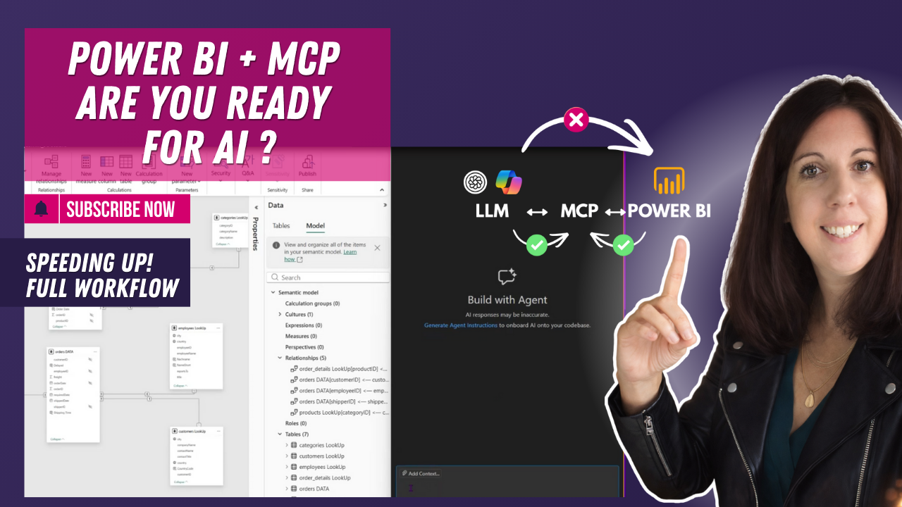

# MCP Server for Power BI

In this tutorial, you’ll learn how to use the MCP server to automate data modeling in Power BI using AI-driven workflows.

We use prompts to generate tables, create relationships, detect schema issues, and apply best practices consistently across your model.

---

## 🎥 Watch the tutorial

[Automate Power BI Modeling with MCP Server](https://www.youtube.com/watch?v=MCB4GtB3T2U&t=9s)

---

## 🧠 What this project does

The MCP server enables a structured and automated approach to Power BI modeling.

It helps you:
- automate model setup and relationships  
- detect and fix schema issues  
- apply naming conventions and best practices  
- improve data health and model consistency  
- safeguard sensitive data  

---

## 🚀 What you’ll learn

In this tutorial, you’ll see:

- how to automate data model connections  
- how to detect schema issues  
- how to generate tables using prompts  
- how to refine relationships efficiently  
- how to apply best practices automatically  
- how to improve data health and security  

---

## 📂 Resources

### Prompt File

Use this prompt to recreate the workflow shown in the video:

➡️ [View prompt](./MCP-Used-Prompts.txt)

### PBIX

Use this .pbix to recreate the workflow shown in the video:

➡️ [View file](./MCP-Northwind-Traders.pbix)

---

## 🎯 Who this is for

- Power BI developers working with complex models  
- BI analysts looking to streamline modeling workflows  
- Teams aiming to standardize data modeling practices  
- Anyone exploring AI-supported data modeling  

---

## 💡 Use cases

- Automating data model setup  
- Improving model consistency and structure  
- Detecting and fixing data issues early  
- Scaling BI development with standardized workflows  

---

## 🛠️ How to use

1. Watch the tutorial  
2. Open the prompt file  
3. Apply it in your MCP setup  
4. Adapt it to your data model  
5. Extend it with your own rules and conventions  

---

## 🔄 Extend this

You can build on this approach by:
- integrating governance rules into prompts  
- standardizing modeling across teams  
- combining MCP with Copilot workflows  
- automating recurring modeling tasks

## 🔗 Related content

📝 LinkedIn Article (DE):  
[Data Therapy – MCP Server Power BI](https://www.linkedin.com/newsletters/data-therapy-regain-clarity-7337435930955321344/)  

🌐 Website Article (DE):  
[MCP Server for Power BI](https://www.jasminsimader.com/data-therapy/mcp-server-power-bi/)
