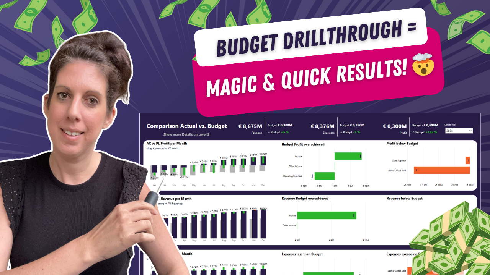

# Budget Overview in Power BI (Drillthrough Button Hack)

In this tutorial, you’ll learn how to create a clean and powerful budget overview in Power BI using a drillthrough button.

With a simple setup, you can build a high-level budget status page in minutes that is both intuitive and reusable.

---

## 🎥 Watch the tutorial

[Create a Powerful Budget Overview with Drillthrough](https://www.youtube.com/watch?v=nurC4MEA4D0&feature=youtu.be)

---

## 🧠 What this project does

This approach helps you quickly build a structured and user-friendly budget overview.

It allows you to:
- create high-level budget summaries  
- navigate seamlessly using drillthrough buttons  
- simplify report navigation  
- build reusable reporting patterns  
- turn simple datasets into professional dashboards  

---

## 🚀 What you’ll learn

In this tutorial, you’ll see:

- how to set up drillthrough buttons correctly  
- how to create a clean budget overview page  
- best practices for high-level budget reporting  
- how to improve usability and navigation  
- how to build reports quickly and efficiently  

---

## 📂 Resources

### Power BI Starter File

Use this file to recreate the solution:

➡️ [Open Power BI file](./FP20-Challenge26-Finance-Budget-Starter-File.pbix)

---

## 🎯 Who this is for

- Power BI developers building financial reports  
- BI analysts working with budget data  
- Anyone creating management dashboards  
- Teams needing fast and reusable reporting solutions  

---

## 💡 Use cases

- Budget vs actual reporting  
- Financial overview dashboards  
- Executive reporting  
- Quick report prototyping  

---

## 🛠️ How to use

1. Watch the tutorial  
2. Open the Power BI file  
3. Explore the drillthrough setup  
4. Adapt it to your own dataset  
5. Extend with additional metrics  

---

## 🔄 Extend this

You can build on this approach by:
- adding variance analysis  
- integrating forecasting  
- combining with KPI cards  
- creating multi-level navigation  

---

## 🔗 Related content

🎥 YouTube: [Power BI with AI Vibes](https://www.youtube.com/@BIVibes-JasminSimader)  
🏠 Website: [Jasmin Simader](https://www.jasminsimader.com/)  
👩🏻‍💻 LinkedIn: [Jasmin Simader](https://www.linkedin.com/in/jasmin-simader)  
📝 Blog / Medium: [Medium Blog](https://medium.com/@jasminsimader)
