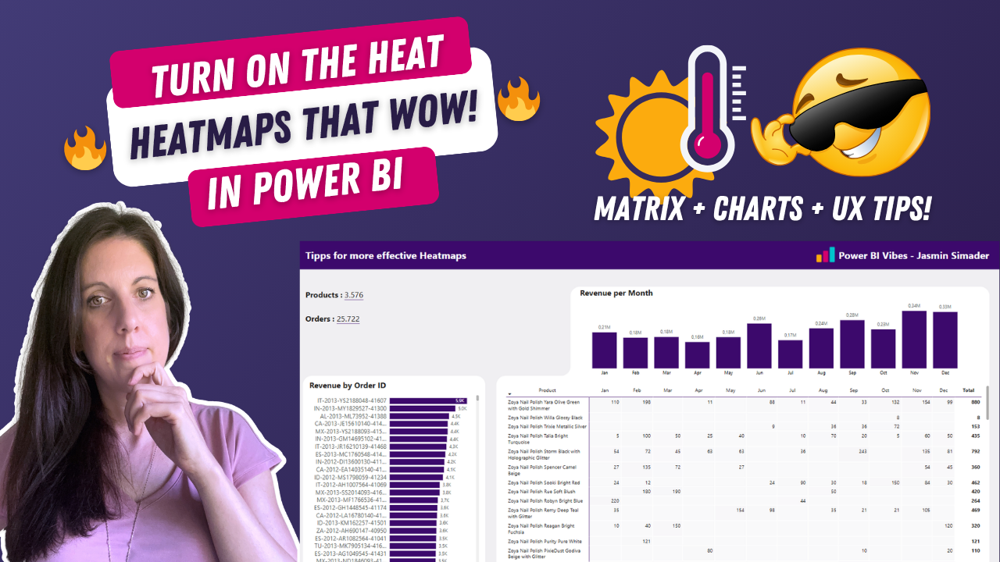
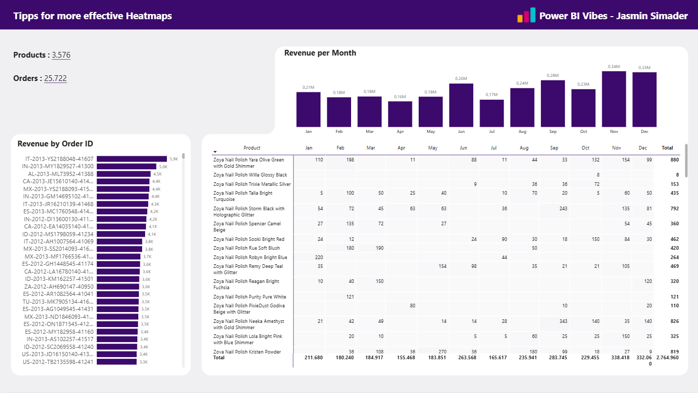

# Heatmaps in Power BI (Matrix + Charts + UX)

In this tutorial, you’ll learn how to build advanced heatmaps in Power BI by combining a matrix visual with bar and column charts.

We focus on creating more dynamic visuals while improving usability and clarity for end users.

---

## 🎥 Watch the tutorial

[Build Stunning Heatmaps in Power BI](https://youtube.com/watch?v=AhNv0EKZ2vQ&feature=youtu.be)

---

## 🧠 What this project does

This approach enhances standard heatmaps by combining multiple visuals into a more powerful and flexible layout.

It allows you to:
- create dynamic heatmaps using matrix visuals  
- combine charts for deeper insights  
- improve readability and structure  
- make filter selections clearly visible  
- build more user-friendly dashboards  

---

## 🚀 What you’ll learn

In this tutorial, you’ll see:

- how to build heatmaps using matrix visuals  
- how to combine matrix, bar, and column charts  
- how to improve visual clarity and structure  
- how to apply UX tips for better user understanding  
- how to design more interactive and insightful visuals  

---

## 📂 Resources

### Power BI Starter File

Use this file to build your own heatmaps:

➡️ [Open Power BI file](./Heatmaps-Starter-File.pbix)

---

## 🖼️ Preview

---

## 🎯 Who this is for

- Power BI developers working with advanced visuals  
- BI analysts building interactive dashboards  
- Anyone creating heatmaps in Power BI  
- Teams focused on usability and visual clarity  

---

## 💡 Use cases

- Performance analysis dashboards  
- Comparing values across categories  
- Identifying trends and patterns  
- Enhancing matrix-based reporting  

---

## 🛠️ How to use

1. Watch the tutorial  
2. Open the Power BI file  
3. Explore the visual setup  
4. Adapt it to your dataset  
5. Extend with your own metrics and filters  

---

## 🔄 Extend this

You can build on this approach by:
- adding conditional formatting variations  
- integrating with KPI cards  
- combining with slicer improvements  
- standardizing heatmap layouts across reports  

---

## 🔗 Related content

🎥 YouTube: [Power BI with AI Vibes](https://www.youtube.com/@BIVibes-JasminSimader)  
🏠 Website: [Jasmin Simader](https://www.jasminsimader.com/)  
👩🏻‍💻 LinkedIn: [Jasmin Simader](https://www.linkedin.com/in/jasmin-simader)  
📝 Blog / Medium: [Medium Blog](https://medium.com/@jasminsimader)
