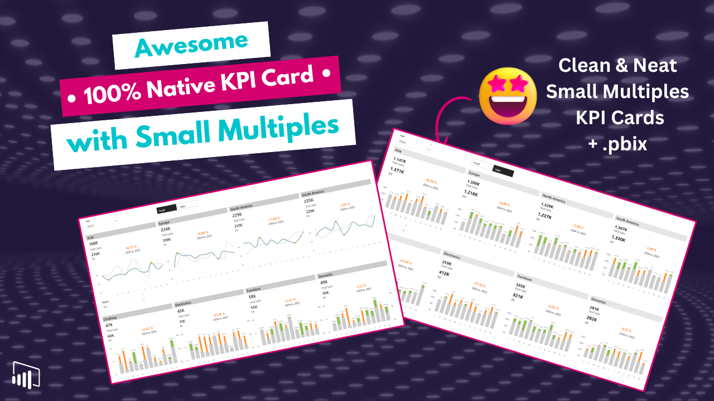
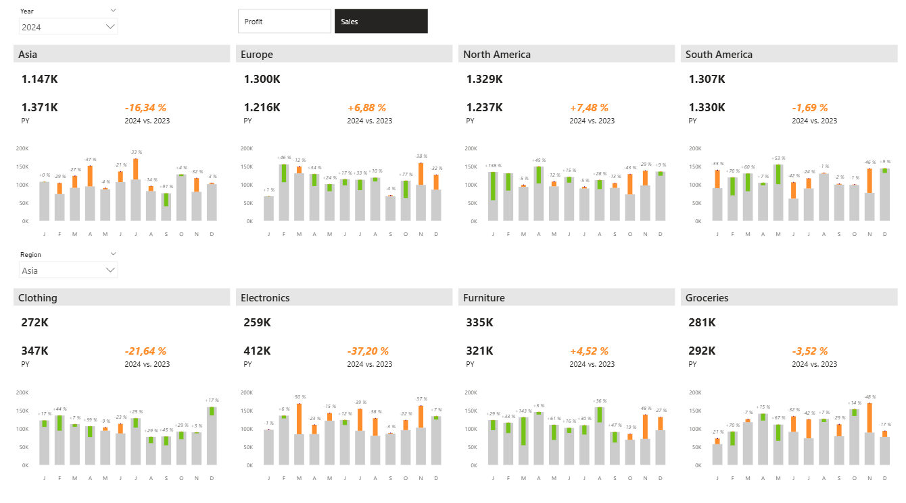
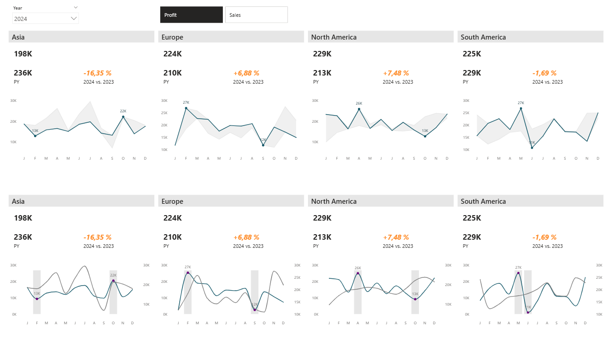

# KPI Cards with Small Multiples & IBCS Style (100% Native)

In this tutorial, you’ll learn how to build compact KPI cards using small multiples and error bars in Power BI.

We apply IBCS-style design principles to clearly show deviations — all built with native visuals, without using SVGs.

---

## 🎥 Watch the tutorial

[Compact KPI Cards with Small Multiples in Power BI](https://www.youtube.com/watch?v=CaMjLr_CYhU&feature=youtu.be)

---

## 🧠 What this project does

This approach helps you visualize KPI deviations in a structured and consistent way.

It allows you to:
- display KPI trends using small multiples  
- highlight deviations using error bars  
- apply IBCS-style visual design  
- build clean and comparable KPI layouts  
- keep everything fully native and maintainable  

---

## 🚀 What you’ll learn

In this tutorial, you’ll see:

- how to build KPI cards with small multiples  
- how to use error bars to show deviations  
- how to apply IBCS-style design principles  
- how to structure KPI comparisons effectively  
- how to create clean and scalable visual patterns  

---

## 📂 Resources

### Power BI File

Explore the full KPI setup:

➡️ [Open Power BI file](./KPI-Cards-Small-Multiples.pbix)

---

## 🖼️ Preview

### Bar Chart Version

### Line Chart Version

---

## 🎯 Who this is for

- Power BI developers focused on advanced design  
- BI analysts working with KPI reporting  
- Anyone applying IBCS principles  
- Teams standardizing KPI visualization  

---

## 💡 Use cases

- KPI deviation analysis  
- Performance monitoring dashboards  
- Comparing categories across time  
- Standardized KPI reporting  

---

## 🛠️ How to use

1. Watch the tutorial  
2. Open the Power BI file  
3. Explore the small multiples setup  
4. Adapt it to your own KPIs  
5. Extend with your own measures  

---

## 🔄 Extend this

You can build on this approach by:
- combining with KPI card layouts  
- integrating with dashboards and drillthrough  
- standardizing IBCS-style visuals across reports  
- adding dynamic formatting and filters  

---

## 🔗 Related content

🎥 YouTube: [Power BI with AI Vibes](https://www.youtube.com/@BIVibes-JasminSimader)  
🏠 Website: [Jasmin Simader](https://www.jasminsimader.com/)  
👩🏻‍💻 LinkedIn: [Jasmin Simader](https://www.linkedin.com/in/jasmin-simader)  
📝 Blog / Medium: [Medium Blog](https://medium.com/@jasminsimader)
