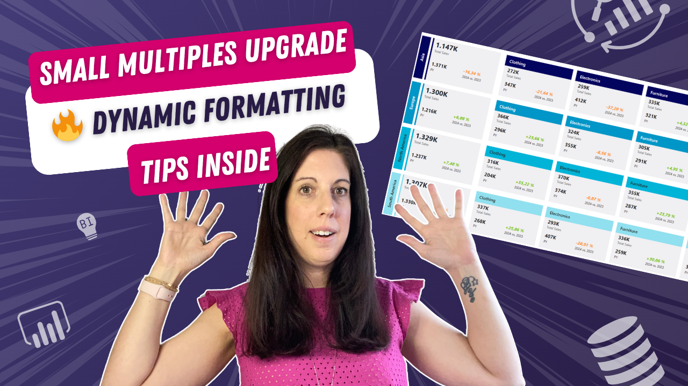

# KPI Cards with Small Multiples (Advanced Formatting V02)

In this tutorial, you’ll learn how to take Power BI Small Multiples to the next level using advanced dynamic formatting techniques.

We enhance KPI layouts by adding conditional styling, dynamic titles, and improved visual structure — all built with native Power BI features.

---

## 🎥 Watch the tutorial

[Small Multiples Upgrade – Advanced Formatting in Power BI](https://www.youtube.com/watch?v=LQzDZYHBsTs&feature=youtu.be)

---

## 🧠 What this project does

This approach helps you create more dynamic and visually structured KPI layouts using Small Multiples.

It allows you to:
- apply conditional formatting to headers  
- dynamically adjust titles based on data  
- improve layout with rotated titles  
- highlight categories using accent bars  
- create more engaging and readable visuals  

---

## 🚀 What you’ll learn

In this tutorial, you’ll see:

- how to conditionally format header backgrounds  
- how to dynamically change titles  
- how to rotate titles for better layout  
- how to add accent bars for visual emphasis  
- how to enhance Small Multiples with minimal effort  

---

## 📂 Resources

### Power BI File

Explore the full setup:

➡️ [Open Power BI file](./KPI-Card-Small-Multiples-Table.pbix)

---

## 🖼️ Preview

---

## 🎯 Who this is for

- Power BI developers focusing on advanced design  
- BI analysts improving report usability  
- Anyone working with Small Multiples  
- Teams aiming for more dynamic dashboards  

---

## 💡 Use cases

- KPI dashboards with dynamic styling  
- Category-based comparisons  
- Enhancing readability in dense reports  
- Adding visual hierarchy to dashboards  

---

## 🛠️ How to use

1. Watch the tutorial  
2. Open the Power BI file  
3. Explore the formatting setup  
4. Apply it to your own reports  
5. Combine with existing KPI patterns  

---

## 🔄 Extend this

You can build on this approach by:
- combining with KPI cards and small multiples (V01)  
- adding dynamic color logic  
- integrating user-driven filters  
- creating reusable formatting templates  

---

## 🔗 Related content

🎥 YouTube: [Power BI with AI Vibes](https://www.youtube.com/@BIVibes-JasminSimader)  
🏠 Website: [Jasmin Simader](https://www.jasminsimader.com/)  
👩🏻‍💻 LinkedIn: [Jasmin Simader](https://www.linkedin.com/in/jasmin-simader)  
📝 Blog / Medium: [Medium Blog](https://medium.com/@jasminsimader)
