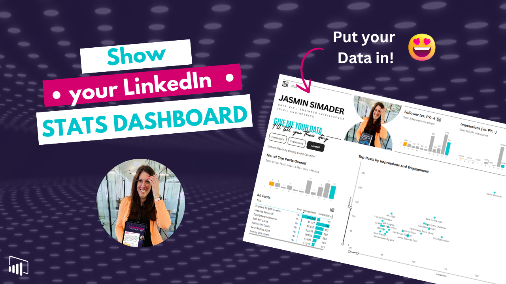
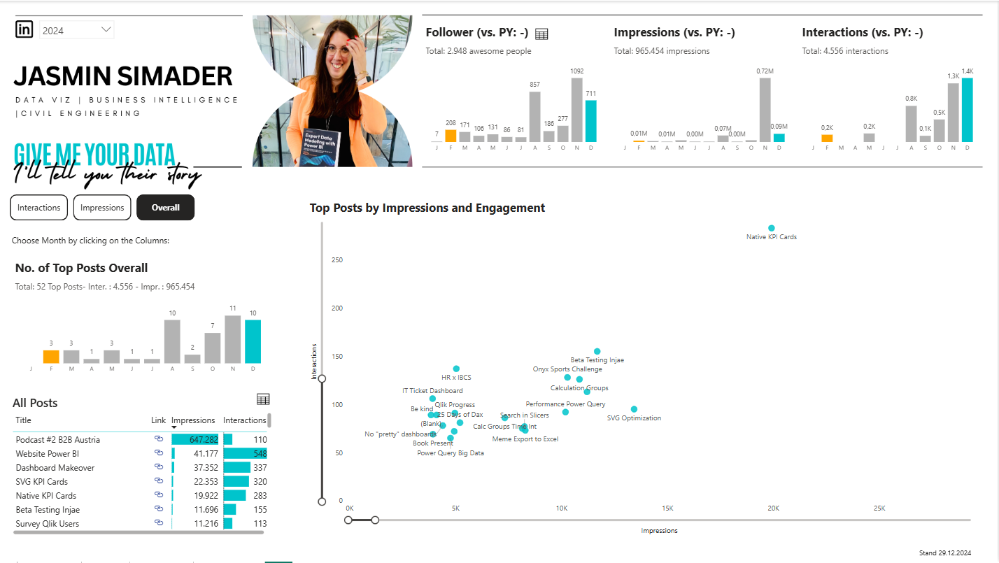

# LinkedIn Performance Dashboard in Power BI

In this tutorial, you’ll learn how to build your own LinkedIn Analysis Dashboard in Power BI to track content performance and better understand your personal brand.

We use a simple and structured approach to turn LinkedIn data into meaningful insights.

---

## 🎥 Watch the tutorial

[Build your own LinkedIn Analysis Dashboard with Power BI](https://youtube.com/watch?v=bjDjU5XDqdM&feature=youtu.be)

---

## 🧠 What this project does

This dashboard helps you analyze and visualize your LinkedIn activity and performance.

It allows you to:
- track post performance and engagement  
- analyze trends over time  
- understand what content works best  
- monitor growth and activity  
- turn raw LinkedIn data into actionable insights  

---

## 🚀 What you’ll learn

In this tutorial, you’ll see:

- how to structure a LinkedIn performance dashboard  
- how to visualize engagement and activity metrics  
- how to analyze content performance  
- how to design a clean and user-friendly dashboard  
- how to use a reusable Power BI template  

---

## 📂 Resources

### Power BI Template

Use this file to build your own LinkedIn dashboard:

➡️ [Open Power BI file](./LinkedIn-Performance-Dashboard.pbix)

---

## 🖼️ Preview

---

## 🎯 Who this is for

- Power BI users building personal dashboards  
- Content creators tracking LinkedIn performance  
- BI analysts exploring social media data  
- Anyone interested in data-driven personal branding  

---

## 💡 Use cases

- Tracking LinkedIn post performance  
- Monitoring engagement trends  
- Improving content strategy  
- Building personal analytics dashboards  

---

## 🛠️ How to use

1. Watch the tutorial  
2. Open the Power BI file  
3. Connect your own LinkedIn data  
4. Explore and adapt the dashboard  
5. Extend with your own metrics  

---

## 🔄 Extend this

You can build on this approach by:
- adding additional social media platforms  
- tracking long-term performance trends  
- combining with KPI card designs  
- creating a full personal analytics dashboard  

---

## 🔗 Related content

🎥 YouTube: [Power BI with AI Vibes](https://www.youtube.com/@BIVibes-JasminSimader)  
🏠 Website: [Jasmin Simader](https://www.jasminsimader.com/)  
👩🏻‍💻 LinkedIn: [Jasmin Simader](https://www.linkedin.com/in/jasmin-simader)  
📝 Blog / Medium: [Medium Blog](https://medium.com/@jasminsimader)
