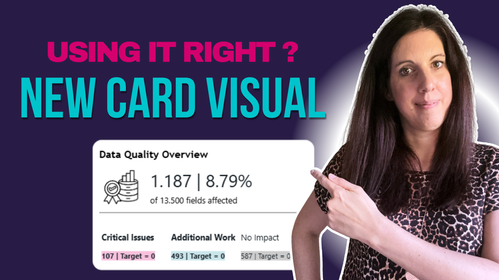
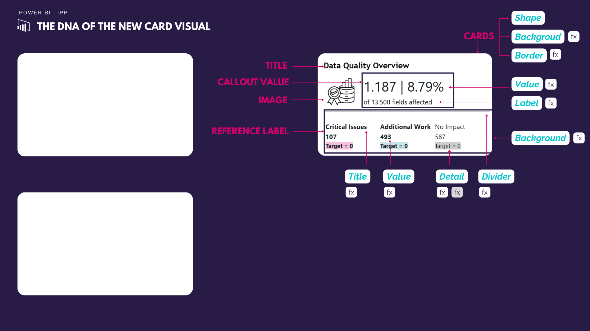

# New Card Visual in Power BI

In this tutorial, you’ll learn how to use the new Power BI Card Visual to present KPIs in a clear, modern, and impactful way.

We walk through the features step by step and show how to design cards that actually communicate insights effectively.

---

## 🎥 Watch the tutorial

[New Power BI Card Visual Explained](https://youtube.com/watch?v=uWOOA7_IEEs&feature=youtu.be)

---

## 🧠 What this project does

This project helps you understand and apply the new Card Visual in Power BI.

It allows you to:
- present KPIs in a clean and modern format  
- improve readability and focus in dashboards  
- use advanced formatting options effectively  
- design visuals that communicate clearly  

---

## 🚀 What you’ll learn

In this tutorial, you’ll see:

- how the new Card Visual differs from the old one  
- how to customize layout and formatting  
- how to highlight key metrics effectively  
- how to design KPI cards that stand out  
- how to improve dashboard clarity  

---

## 📂 Resources

### Visual Setup & Design Reference

Use the provided image as a reference for building your own card layouts:

➡️ [View card structure](./New-Card-Visual-DNA.png)

---

## 🖼️ Preview

---

## 🎯 Who this is for

- Power BI developers focused on design  
- BI analysts building KPI dashboards  
- Anyone working with Power BI visuals  
- Teams improving dashboard communication  

---

## 💡 Use cases

- KPI cards for executive dashboards  
- Highlighting key metrics clearly  
- Improving visual storytelling  
- Standardizing card design across reports  

---

## 🛠️ How to use

1. Watch the tutorial  
2. Recreate the card using the visual settings  
3. Use the DNA image as a design reference  
4. Apply it to your own KPIs  
5. Adapt layout and formatting  

---

## 🔄 Extend this

You can build on this approach by:
- combining with KPI card layouts  
- integrating with line chart KPI cards  
- standardizing visual design across reports  
- creating reusable dashboard templates  

---

## 🔗 Related content

🎥 YouTube: [Power BI with AI Vibes](https://www.youtube.com/@BIVibes-JasminSimader)  
🏠 Website: [Jasmin Simader](https://www.jasminsimader.com/)  
👩🏻‍💻 LinkedIn: [Jasmin Simader](https://www.linkedin.com/in/jasmin-simader)  
📝 Blog / Medium: [Medium Blog](https://medium.com/@jasminsimader)
