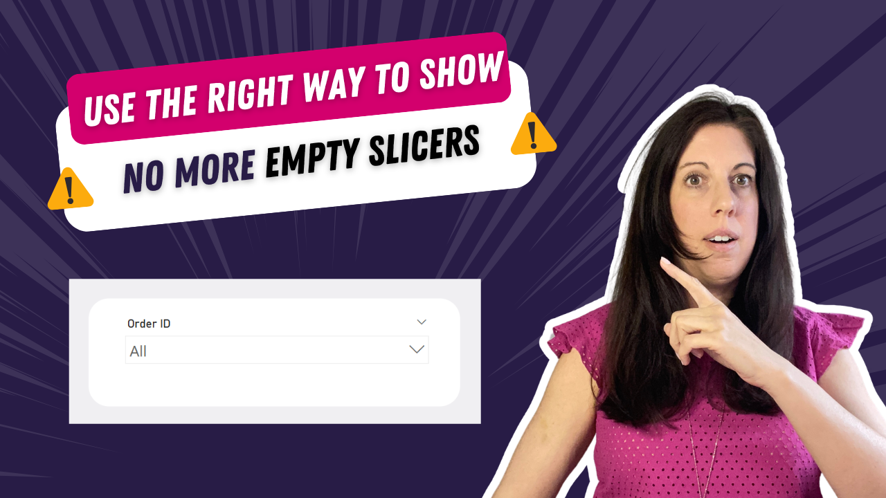

# No More Empty Slicers in Power BI

In this tutorial, you’ll learn how to properly hide irrelevant slicer values in Power BI without breaking your data model.

Instead of using risky shortcuts like changing relationships to “both”, we apply a structured approach that keeps your model clean and your results accurate.

---

## 🎥 Watch the tutorial

[Stop Wasting Time! Hide Useless Slicer Values in Power BI](https://www.youtube.com/watch?v=pOn5ywKF3Xk&feature=youtu.be)

---

## 🧠 What this project does

This solution helps you improve both usability and data integrity in Power BI reports.

It allows you to:
- dynamically hide slicer values with no matching data  
- avoid incorrect model behavior caused by bidirectional filters  
- keep relationships clean and well-structured  
- improve report clarity for end users  

---

## 🚀 What you’ll learn

In this tutorial, you’ll see:

- why using “both” relationships can cause issues  
- how to filter slicers based on fact table data  
- how to create dynamic filtering logic  
- how to improve report usability without breaking your model  

---

## 📂 Resources

### Power BI File

Explore the full example shown in the video:

➡️ [Open Power BI file](./Power-BI-No-Empty-Slicers.pbix)

---

## 🎯 Who this is for

- Power BI developers working with relational models  
- BI analysts building user-friendly reports  
- Anyone struggling with messy slicers  
- Teams focused on clean and reliable data models  

---

## 💡 Use cases

- Cleaning up slicers in dashboards  
- Improving report usability  
- Preventing incorrect filter propagation  
- Maintaining proper model relationships  

---

## 🛠️ How to use

1. Watch the tutorial  
2. Open the Power BI file  
3. Explore how slicer filtering is implemented  
4. Apply the logic to your own model  
5. Adapt based on your data structure  

---

## 🔄 Extend this

You can build on this approach by:
- applying the logic across multiple slicers  
- combining with calculation groups  
- integrating into reusable report templates  
- standardizing slicer behavior across reports  

---

## 🔗 Related content

🎥 YouTube: [Power BI with AI Vibes](https://www.youtube.com/@BIVibes-JasminSimader)  
🏠 Website: [Jasmin Simader](https://www.jasminsimader.com/)  
👩🏻‍💻 LinkedIn: [Jasmin Simader](https://www.linkedin.com/in/jasmin-simader)  
📝 Blog / Medium: [Medium Blog](https://medium.com/@jasminsimader)
