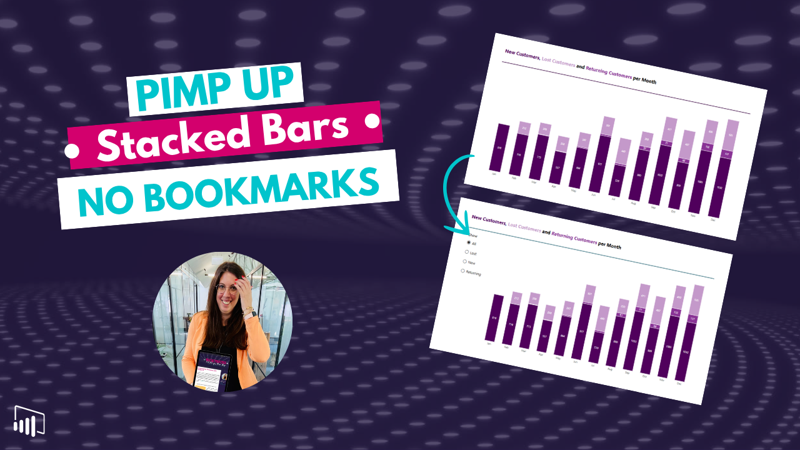
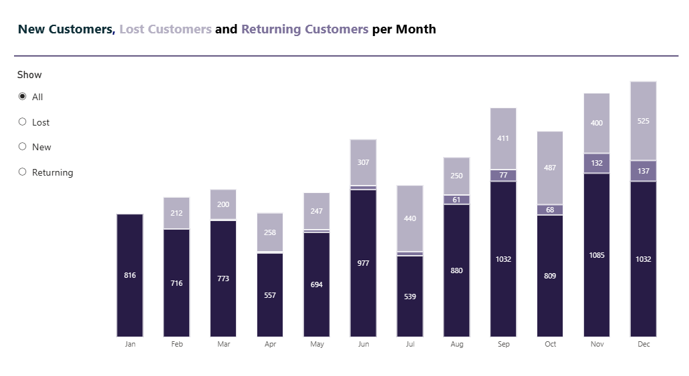

# Improve Stacked Bar Charts in Power BI (No Bookmarks)

In this tutorial, you’ll learn how to make stacked bar charts more readable in Power BI without using bookmarks.

We use a simple technique to improve label clarity and visual structure, making your charts easier to understand at a glance.

---

## 🎥 Watch the tutorial

[Make Stacked Bar Charts More Readable in Power BI](https://youtube.com/watch?v=HZxhuYvO4G4&feature=youtu.be)

---

## 🧠 What this project does

This approach improves the readability of stacked bar charts in Power BI.

It allows you to:
- avoid overlapping or unreadable data labels  
- improve clarity without complex workarounds  
- eliminate the need for bookmarks  
- create cleaner and more user-friendly visuals  

---

## 🚀 What you’ll learn

In this tutorial, you’ll see:

- why stacked bar charts often become hard to read  
- how to adjust the series display for better clarity  
- how to improve label visibility  
- how to simplify visuals without adding complexity  
- how to enhance usability in your reports  

---

## 📂 Resources

### Power BI File

Explore the example shown in the video:

➡️ [Open Power BI file](./Stacked-Bar-Charts.pbix)

---

## 🖼️ Preview

---

## 🎯 Who this is for

- Power BI developers working with charts  
- BI analysts improving report usability  
- Anyone using stacked bar visuals  
- Teams focused on clear data communication  

---

## 💡 Use cases

- Improving readability of stacked visuals  
- Simplifying dashboards  
- Enhancing data label clarity  
- Avoiding unnecessary complexity in reports  

---

## 🛠️ How to use

1. Watch the tutorial  
2. Open the Power BI file  
3. Explore the chart settings  
4. Apply the technique to your own visuals  
5. Adapt it to your data structure  

---

## 🔄 Extend this

You can build on this approach by:
- applying similar logic to other chart types  
- combining with KPI visuals  
- standardizing chart design across reports  
- improving overall dashboard readability  

---

## 🔗 Related content

🎥 YouTube: [Power BI with AI Vibes](https://www.youtube.com/@BIVibes-JasminSimader)  
🏠 Website: [Jasmin Simader](https://www.jasminsimader.com/)  
👩🏻‍💻 LinkedIn: [Jasmin Simader](https://www.linkedin.com/in/jasmin-simader)  
📝 Blog / Medium: [Medium Blog](https://medium.com/@jasminsimader)
