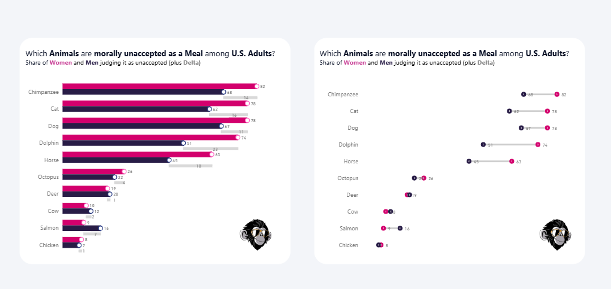
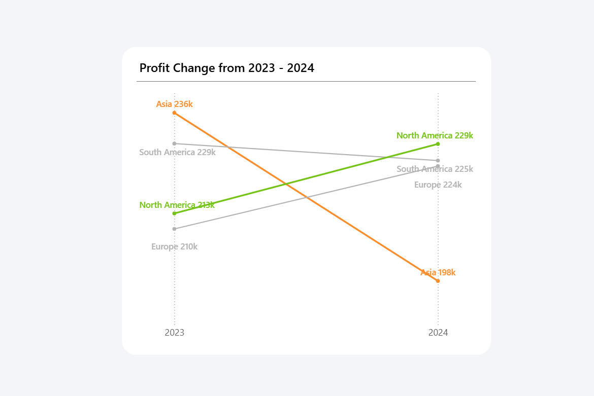

# Visualization Experiments in Power BI

This folder contains a collection of visualization experiments exploring alternative ways to present data in Power BI.

The focus is on improving clarity, comparability, and visual storytelling using native visuals and creative techniques.

---

## 🧠 What this project does

These experiments explore how standard visuals can be adapted to communicate insights more effectively.

They demonstrate:
- alternative chart designs  
- enhanced comparison techniques  
- improved readability and structure  
- creative use of native Power BI visuals  

---

## 📂 Resources

### Power BI Files

Explore the experiments:

➡️ [Error Bars Visualization](./Error%20Bars%20-%20Animals%20and%20Share%20US%20eating.pbix)  
➡️ [Slope Chart](./Power%20BI%20Slope%20Chart.pbix)  

---

## 🖼️ Preview

### Error Bars Visualization

### Slope Chart

---

## 🎯 What is explored

### Error Bars for Comparison
- Comparing groups using ranges and deltas  
- Highlighting differences between categories  
- Improving readability of overlapping values  

### Slope Chart
- Visualizing change between two points in time  
- Highlighting trends and direction clearly  
- Reducing clutter compared to traditional charts  

---

## 💡 Use cases

- Comparing values across categories  
- Showing change over time  
- Highlighting differences between groups  
- Creating more intuitive visual storytelling  

---

## 🛠️ How to use

1. Open the Power BI files  
2. Explore how the visuals are built  
3. Analyze the formatting and layout  
4. Adapt the ideas to your own reports  

---

## 🔄 Extend this

You can build on these ideas by:
- combining with KPI cards  
- integrating into dashboards  
- adding dynamic formatting  
- applying consistent design patterns  

---

## 🔗 Related content

🎥 YouTube: [Power BI with AI Vibes](https://www.youtube.com/@BIVibes-JasminSimader)  
🏠 Website: [Jasmin Simader](https://www.jasminsimader.com/)  
👩🏻‍💻 LinkedIn: [Jasmin Simader](https://www.linkedin.com/in/jasmin-simader)  
📝 Blog / Medium: [Medium Blog](https://medium.com/@jasminsimader)
